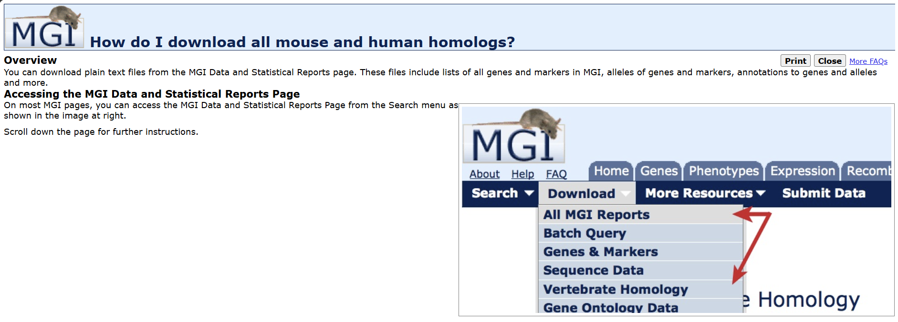
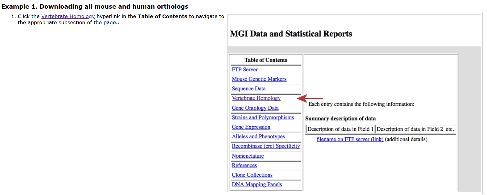
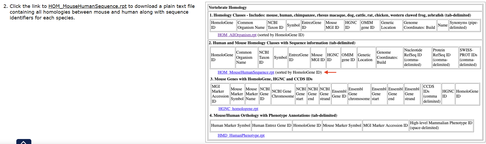

# A40AML_CELLPHONEDB_Analysis
A40(AML)_CELLPHONEDB_Analysis
## 📖 Overview
A40(AML)_CELLPHONEDB_Analysis

## 🚀 How to run

build the cellphonedb env

```bash
conda create -n cpdb python=3.10 -y
conda activate cpdb
```

install cellphonedb
```bash
pip install -U cellphonedb
```

make cpdb_meta from h5ad file
```bash
python make_cpdb_meta_from_h5ad.py \
  --h5ad .../your_file.h5ad \
  --cluster-col cluster \
  --out /root/autodl-tmp/BGI/STOmics/cpdb_inputs/meta_A40.txt
```
download the MGI mouse and human homologs




map mouse to human in h5ad file
```bash
python map_mm_to_hs_from_mgi_v4.py \
  --mgi_rpt /root/autodl-tmp/BGI/mgi/HOM_MouseHumanSequence.rpt.txt \
  --in_h5ad /root/autodl-tmp/BGI/STOmics/spatial_data/bin20_h5ad_10.30/BM26_A40_C05094F1_bin20_annotation.h5ad \
  --out_h5ad /root/autodl-tmp/BGI/STOmics/spatial_data/bin20_h5ad_10.30/BM26_A40_C05094F1_hs_symbol.h5ad \
  --map_csv /root/autodl-tmp/BGI/STOmics/cpdb_inputs/mm2hs_from_mgi.csv \
  --drop_unmapped
```


